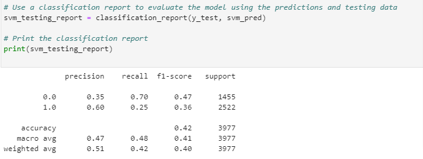
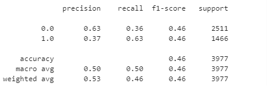
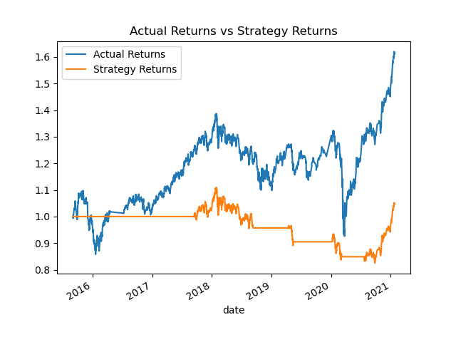
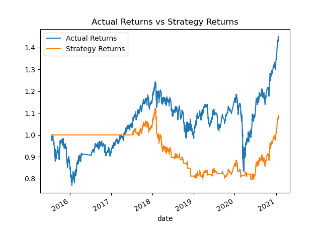

## Tune the Baseline Trading Algorithm
### Step 1: Tune the training algorithm by adjusting the size of the training dataset. 

In this Challenge, we are assume the role of a financial advisor at one of the top five financial advisory firms in the world. 
I defined the following conditions:

If, the Actual Returns > 0 then system returns Signal value as: 1 (BUY)

If, the Actual Returns < 0 then system returns Signal value as: -1 ( SELL)

I have tested various Models to get the accurate predictions, following are the models I have used with their Performance Summary including "Classification Report" & "Cumulative Return Chart":
**Model 1: PERFORMANCE SUMMARY:**

Following the input parameters:

**Simple Moving Averages (SMA):**
Short Window = 50 Days & Long Window = 100 Days

**Model:**
SVC Classifier

**Classification Report:**

**Cumulative Return Plot: Actual Returns vs. Strategy Returns**

**Model:**
SVC Classifier
**Logistic Regression Model Classification Report:**

**Logistic Regression Model Cumulative Return Plot: Actual Returns vs. Strategy Returns**

**Model 2:PERFORMANCE SUMMARY:**

Following the input parameters:

**Simple Moving Averages (SMA):**
Short Window = 8 Days & Long Window = 50 Days

**Model:**
LogisticRegression

**Classification Report:**

**Cumulative Return Plot: Actual Returns vs. Strategy Returns**

**Model:**
LogisticRegression
**Logistic Regression Model Classification Report:**

**Logistic Regression Model Cumulative Return Plot: Actual Returns vs. Strategy Returns**

**Model 3:  PERFORMANCE SUMMARY:**

Following  the input parameters:

**Simple Moving Averages (SMA):**
Short Window = 100 Days & Long Window = 200 Days

**Model:**
SVC Classifier

**Classification Report:**

**Cumulative Return Plot: Actual Returns vs. Strategy Returns**

![[Cumulative Return Plot]](Tuned Model/svm_ModeSMA100SMA200l.PNG)

**Model:**
LogisticRegression

**Logistic Regression Model Classification Report:**

**Logistic Regression Model Cumulative Return Plot: Actual Returns vs. Strategy Returns**

**Results:**
In conclusion,Classification Reports & Cumulative Returns Graphs of the second model with input parameters of short window = 8 and long window = 50 showing the best results. Both SVC Classifier and LogisticRegression Model showing decent improvment in return curve and accuracy score respectively. Based on information provided above, I can say that, decreasing SMA short and long window can improve algorithm trading model performance. 
